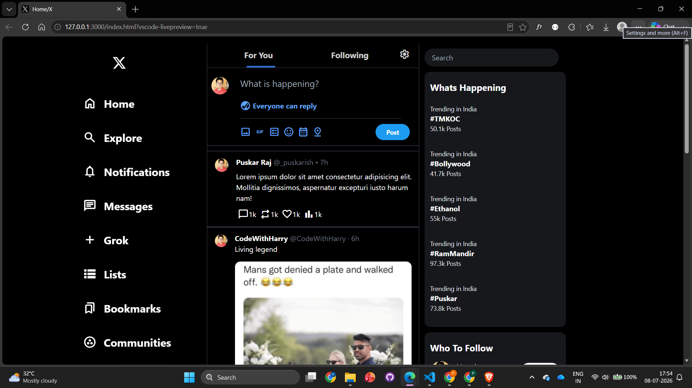
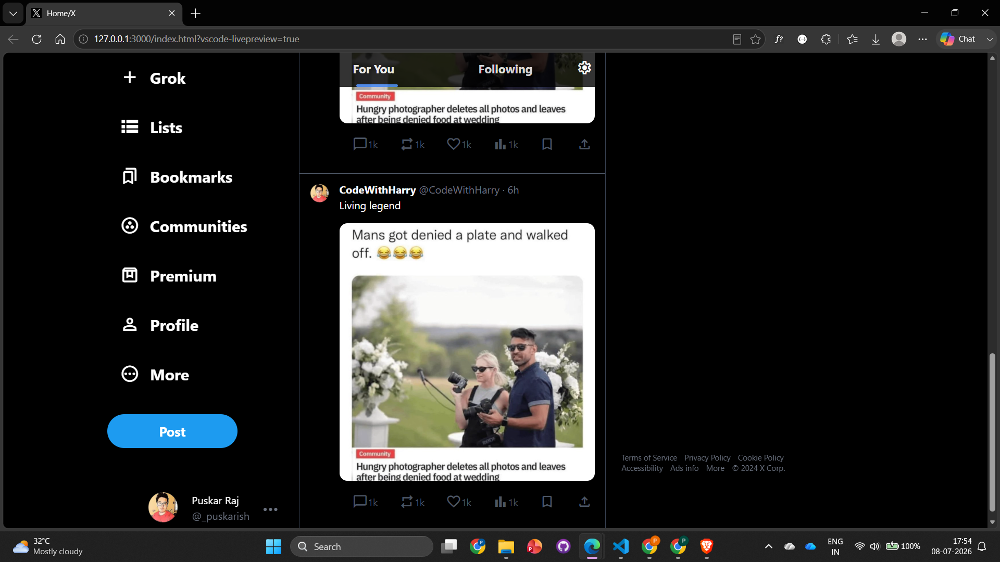
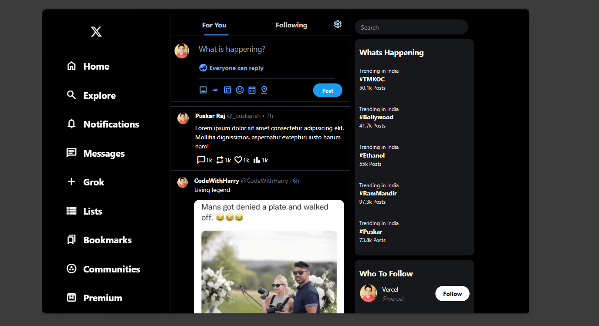
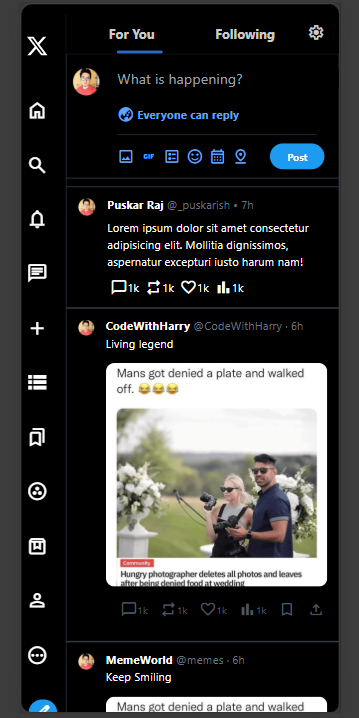
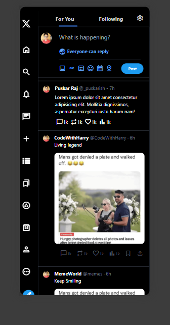
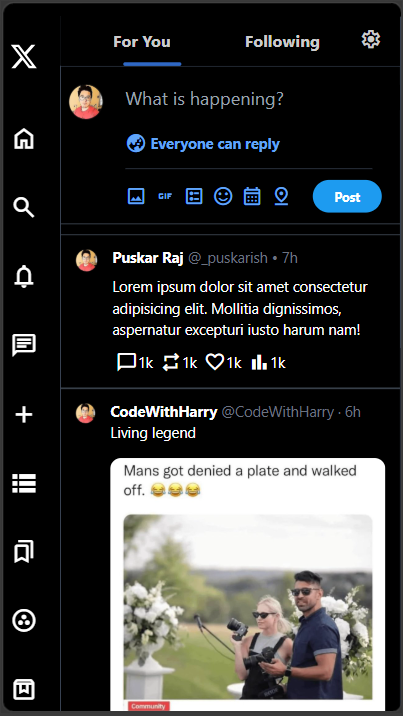

# X (Twitter) Clone

A pixel-perfect and fully responsive clone of the **X (formerly Twitter)** home page built using **HTML** and **Tailwind CSS**. The project recreates the modern X interface with a mobile-first responsive design, closely matching the original layout across desktop, tablet, and mobile devices.

---

## 🚀 Features

- 🎨 Pixel-perfect X (Twitter) UI
- 📱 Fully responsive (Mobile, Tablet & Desktop)
- 🧭 Responsive navigation sidebar
- 📝 Tweet composer section
- 📰 Timeline feed
- 🔥 Trending section
- 👥 Who to Follow section
- 📌 Sticky sidebar and top navigation
- ✨ Interactive hover effects
- ⚡ Built entirely using Tailwind CSS

---

## 🛠️ Tech Stack

- HTML5
- Tailwind CSS
- Google Material Symbols

---

## 📂 Project Structure

```text
X-Clone/
│
├── node_modules/
│
├── preview/
│   ├── pc1.png
│   ├── pc2.png
│   ├── phone1.png
│   ├── phone2.png
│   ├── phone3.png
│   └── tablet1.png
│
├── src/
│   ├── input.css
│   └── output.css
│
├── favicon.ico
├── index.html
├── package.json
├── package-lock.json
├── tailwind.config.js
├── .gitattributes
└── README.md
```

---

# 📸 Preview

## 💻 Desktop

<p align="center">
  
</p>

<p align="center">
  
</p>

---

## 📱 Tablet

<p align="center">
  
</p>

---

## 📲 Mobile

<p align="center">
  
  
  
</p>

---

## 📱 Responsive Design

This project is optimized for:

- 📱 Mobile Devices
- 📟 Tablets
- 💻 Laptops
- 🖥️ Desktop Screens

using Tailwind CSS responsive breakpoints.

---

## 🎯 Learning Outcomes

Through this project, I gained hands-on experience with:

- Tailwind CSS utility-first workflow
- Mobile-first responsive web design
- Flexbox and Grid layouts
- Sticky positioning
- Responsive breakpoints
- Building production-like UI
- Modern frontend layout structuring

---

## 📄 Disclaimer

This project is created solely for educational and learning purposes. It is a UI clone of X (formerly Twitter) and is not affiliated with or endorsed by X Corp.
